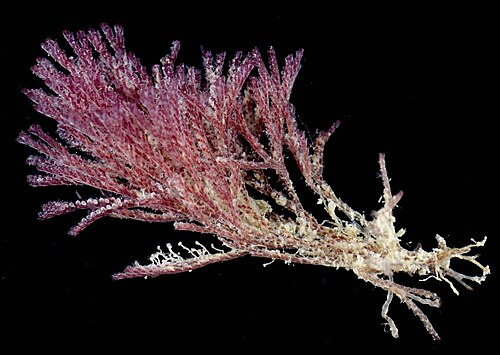

## Welcome to STA 711!

Agenda:

<br/>

* Brief course overview and syllabus highlights

<br/>

* Sketch plan for first couple weeks

<br/>

* Linear regression

\vspace{3cm}

## Core course content

* Estimation
  * How do we estimate unknown parameters?
  * How do we assess uncertainty in our estimates?
  * What makes a "good" estimator?

<br/>

<br/>
  
* Asymptotics
  * What happens to our estimators as the sample size gets large?

<br/>  

<br/>

* Hypothesis testing
  * How do we assess competing hypotheses about the data generating process?

## Course motivation

* Regression models are a natural setting for many of the key topics in 711

<br/>

* We are already familiar with the idea of regression, and these models provide a good motivation for much of our course content

<br/>

* Regression models are naturally multivariable

<br/>

* STA 712 (GLMs) builds on our 711 material; I view 711/712 as a two-course sequence

<br/>

* So: Regression (particularly linear and logistic regression) will be used as motivation throughout

## Course structure

* Class participation and seminar attendance

<br/>

* Regular HW assignments (due most weeks)

<br/>

* Homework presentations (3)

<br/>

* Two midterm exams

<br/>

* Final exam

\vspace{3cm}

## Plan for the first couple weeks

* Brief overview/review of linear regression

<br/>

* Introduction to logistic regression and parameter estimation

<br/>

* Maximum likelihood estimation

\vspace{3cm}

## Motivating example: mass and metabolic rate

* Researchers are interested in the relationship between an organism's mass and metabolic rate (how much energy it consumes)
* To study this relationship, they collected data on 568 individuals from two species of marine bryozoan



## Motivating example: mass and metabolic rate

For each individual, the researchers recorded the mass and metabolic rate:

```{r, include=F}
library(readr)
library(tidyverse)

bryozoan <- read_csv("https://raw.githubusercontent.com/ciaran-evans/bryozoan-data-paper/refs/heads/master/bryozoan_data_fixed.csv")
```

```{r, echo=F, message=F, fig.width=3, fig.height=2, fig.align='center'}
bryozoan |>
  ggplot(aes(x = Mass, y = Metabolic)) +
  geom_point(size=0.5) +
  theme_bw() +
  labs(x = "Mass (micrograms)", y = "Metabolic rate (mJ/hr)")
```

**Question:** What do you notice about this relationship?

## Motivating example: mass and metabolic rate

```{r, echo=F, message=F, fig.width=2.5, fig.height=2, fig.align='center'}
bryozoan |>
  ggplot(aes(x = Mass, y = Metabolic)) +
  geom_point(size=0.5) +
  geom_smooth(method = "lm", se=F) +
  theme_bw() +
  labs(x = "Mass (micrograms)", y = "Metabolic rate (mJ/hr)")
```

If I wanted to write down a model for the relationship between mass and metabolic rate, what would it look like?

\vspace{1cm}

## Linear regression model

$$\text{Metabolic}_i = \beta_0 + \beta_1 \text{Mass}_i + \varepsilon_i$$

What do the parameters $\beta_0$ and $\beta_1$ represent?

\vspace{3cm}

## Linear regression model

```{r, echo=F, message=F, fig.width=2.5, fig.height=2, fig.align='center'}
bryozoan |>
  ggplot(aes(x = Mass, y = Metabolic)) +
  geom_point(size=0.5) +
  geom_smooth(method = "lm", se=F) +
  theme_bw() +
  labs(x = "Mass (micrograms)", y = "Metabolic rate (mJ/hr)")
```

$$\text{Metabolic}_i = \beta_0 + \beta_1 \text{Mass}_i + \varepsilon_i$$

The true $\beta_0$ and $\beta_1$ are **unknown**. How do I estimate them from data?


## Fitting a linear regression model

$$\text{Metabolic}_i = \beta_0 + \beta_1 \text{Mass}_i + \varepsilon_i$$
Choosen $\beta_0, \beta_1$ to minimize

$$SSE(\beta_0, \beta_1) = \sum \limits_{i=1}^n (\text{Metabolic}_i - \beta_0 - \beta_1 \text{Mass}_i)^2$$

**Question:** How would I solve this minimization problem?

\vspace{3cm}

## Fitting a linear regression model

**Model**:

$$Y_i = \beta_0 + \beta_1 X_{i1} + \beta_2 X_{i2} + \cdots + \beta_k X_{ik} + \varepsilon_i$$

**Observed data**: $(X_{11}, X_{12},...,X_{1k}, Y_1), ..., (X_{n1}, X_{n2},...,X_{nk}, Y_n)$

**Estimation**: choose $\beta_0, \beta_1,...,\beta_k$ to minimize

$$SSE(\beta_0,...,\beta_k) = \sum \limits_{i=1}^n (Y_i - \beta_0 - \beta_1 X_{i1} - \cdots - \beta_k X_{ik})^2$$

How would I solve this minimization problem?

\vspace{2.5cm}

## Improving our life with linear algebra

$$
\begin{aligned}
Y_1 &= \beta_0 + \beta_1 X_{11} + \beta_2 X_{12} + \cdots + \beta_k X_{1k} + \varepsilon_1 \\
Y_2 &= \beta_0 + \beta_1 X_{21} + \beta_2 X_{22} + \cdots + \beta_k X_{2k} + \varepsilon_2 \\
&\vdots \\
Y_n &= \beta_0 + \beta_1 X_{n1} + \beta_2 X_{n2} + \cdots + \beta_k X_{nk} + \varepsilon_n
\end{aligned}
$$

\vspace{4cm}

## Improving our life with linear algebra

$$
\begin{aligned}
Y_1 &= \beta_0 + \beta_1 X_{11} + \beta_2 X_{12} + \cdots + \beta_k X_{1k} + \varepsilon_1 \\
Y_2 &= \beta_0 + \beta_1 X_{21} + \beta_2 X_{22} + \cdots + \beta_k X_{2k} + \varepsilon_2 \\
&\vdots \\
Y_n &= \beta_0 + \beta_1 X_{n1} + \beta_2 X_{n2} + \cdots + \beta_k X_{nk} + \varepsilon_n
\end{aligned}
$$


$$
\begin{bmatrix} Y_1 \\ Y_2 \\ \vdots \\ Y_n  \end{bmatrix} = \begin{bmatrix} 1 & X_{11} & X_{12} & \cdots & X_{1k} \\
1 & X_{21} & X_{22} & \cdots & X_{2k} \\
\vdots & \vdots & \vdots & \ddots & \vdots \\ 
1 & X_{n1} & X_{n2} & \cdots & X_{nk}\end{bmatrix} \begin{bmatrix} \beta_0 \\  \vdots \\ \beta_k \end{bmatrix} + \begin{bmatrix} \varepsilon_1 \\ \varepsilon_2 \\ \vdots \\ \varepsilon_n \end{bmatrix}
$$

## Rewriting the optimization problem

$$
\boldsymbol{Y} = \mathbf{X} \boldsymbol{\beta} + \boldsymbol{\varepsilon}
$$

$$
SSE(\boldsymbol{\beta}) = \hspace{6cm} 
$$

\vspace{5cm}

## Solving the optimization problem


