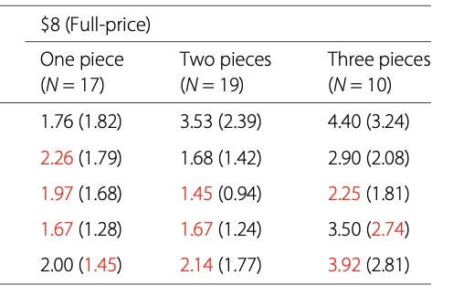

## Questions

1. What did you think overall of the articles?

\bigskip

2. How does Ioannidis come to the conclusion that most published research findings are false?

\bigskip

3. Which factors does Ioannidis claim will cause published research to be *more likely* to be false?

\bigskip

4. Do *you* think that most published research findings are false?

\bigskip

## "File drawer" problem

**Issue:** Results which aren't "statistically significant" don't get reported

\bigskip

**Outcome:** 

1. The estimated effect size for studies which **do** get published is upwardly biased
2. The estimated effect size for a **replication** study is often much smaller than the original study

\vspace{4cm}

## What's wrong here?

From "Regulation of REM and Non-REM Sleep by Periaqueductal GABAergic Neurons" (Weber et al., 2018):

\bigskip

"For optogenetic activation experiments, cell-type-specific ablation experiments, and in vivo recordings (optrode recordings and calcium imaging), we continuously increased the number of animals until statistical significance was reached to support our conclusions."

\vspace{4cm}

## Cornell Food and Brand Lab

What were some of the issues described for the Cornell Food and Brand Lab?

\vspace{5cm}

## Cornell Food and Brand Lab

